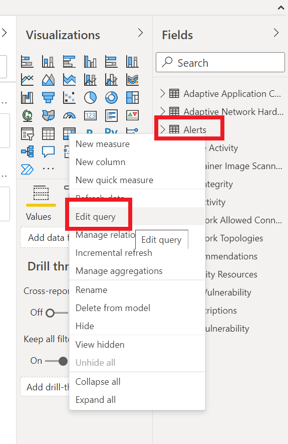

# Microsoft Defender for Cloud : Lab 2 : REST APIs

## Exercise 1: REST APIs

### Task 1: Log Analytics

1. Connect over RDP to the **wssecuritySUFFIX-win10** virtual machine using the `wsuser` username and the lab password
2. Open a Windows PowerShell ISE window
3. Copy and then execute the following script:

    ```PowerShell
    . C:\LabFiles\Common.ps1

    Login-AzureCredsPowerShell

    $azToken = Get-AzAccessToken -ResourceUrl "https://api.loganalytics.io";

    $global:logsToken = $azToken.Token;
    
    $rg = (Get-AzResourceGroup | Where-Object { $_.ResourceGroupName -like "*-security" });
    $resourceGroupName = $rg.ResourceGroupName
    $deploymentId =  (Get-AzResourceGroup -Name $resourceGroupName).Tags["DeploymentId"]

    $wsName = "wssecurity" + $deploymentId;
    $ws = Get-AzOperationalInsightsWorkspace -Name $wsName -ResourceGroup $resourceGroupName;
    $workspaceId = $ws.CustomerId;
    $keys = Get-AzOperationalInsightsWorkspaceSharedKey -ResourceGroup $resourceGroupName -Name $wsName;
    $workspaceKey = $keys.PrimarySharedKey;

    $url = "https://api.loganalytics.io/v1/workspaces/" + $WorkspaceId + "/query";

    $query = "AzureActivity";

    $logQueryBody = @{"query" = $query} | convertTo-Json

    $result = Invoke-RestMethod  -Uri $url -Method POST -Body $logQueryBody -ContentType "application/json" -Headers @{"Authorization"="Bearer $logsToken"};

     $result.tables[0].columns
    ```

4. Review the results from the REST api call. You can make calls from your own applications to integrate with the Log Analytics data.

### Task 2: Azure Resource Graph Queries

1. Open a Windows PowerShell window
2. Run the following script:

    ```PowerShell
    . C:\LabFiles\Common.ps1

    Login-AzureCredsPowerShell

    $azToken = Get-AzAccessToken -ResourceUrl "https://management.azure.com";

    $global:managementToken = $azToken.Token;

    $sub = Get-AzSubscription
    $subscriptionId = $sub.Id;

    $url = "https://management.azure.com/providers/Microsoft.ResourceGraph/resources?api-version=2018-09-01-preview";

    $query = "securityresources";

    $logQueryBody = @{"options" = $null; "subscriptions" = @( $subscriptionId); "query" = $query} | convertTo-Json

    $result = Invoke-RestMethod  -Uri $url -Method POST -Body $logQueryBody -ContentType "application/json" -Headers @{"Authorization"="Bearer $managementToken"};

    $result.data;

    ```

## Exercise 2: Visualize Recommendations with Power BI

### Task 1: Create KQL Query

1. Browse to the `wssecuritySUFFIX` log analytics workspace
2. Under **General**, select **Logs**
3. Run the following query

    ```kql
    AzureActivity
    ```

4. Select **Export->Export to Power BI (M Query)**
5. Open the downloaded file
6. Follow in the instructions in the downloaded file to run the analytics query

### Task 2: Export All Microsoft Defender for Cloud data with Power BI

1. Open the `/artifacts/day-01/MicrosoftDefender.pbix` file
2. Right-click the `Alerts` data source, select **Edit**

    

3. Select the `Alerts` data source, in the ribbon, select **Advanced Editor**.
4. Review the query.  

    

5. Repeat for all the data sources in the Power BI report.
6. Run the `/artifacts/day-01/GenerateVariables.ps1` PowerShell script, this will retrieve your subscription, tenant and workspaceId into a file
7. Run the `/artifacts/day-01/GenerateTokens.ps1` PowerShell script, this will generate access tokens valid for one hour for accessing the various rest apis
8. Select **Refresh Preview**, you should see all the data sources update with Microsoft Defender for Cloud related items.
9. Review each data source.

## Reference Links

- [Azure Resource Graph APIs](https://docs.microsoft.com/en-us/rest/api/azure-resourcegraph/)
- [Azure Log Analytics API](https://dev.loganalytics.io/)
