# Configure Sentinel and Defender Integration

## Exercise 1 : Azure Sentinel Basics

1. Open the Azure Portal in your **paw-1** virtual machine
2. Search for and select **Azure Sentinel**
3. Select the **wssecuritySUFFIX** log analytics workspace
4. Under **General**, select **Logs**
5. If prompted with any dialogs, close them.
6. You should see some previous queries that were run previously
7. Take a few minutes to explore the various Azure Sentinel blade items

    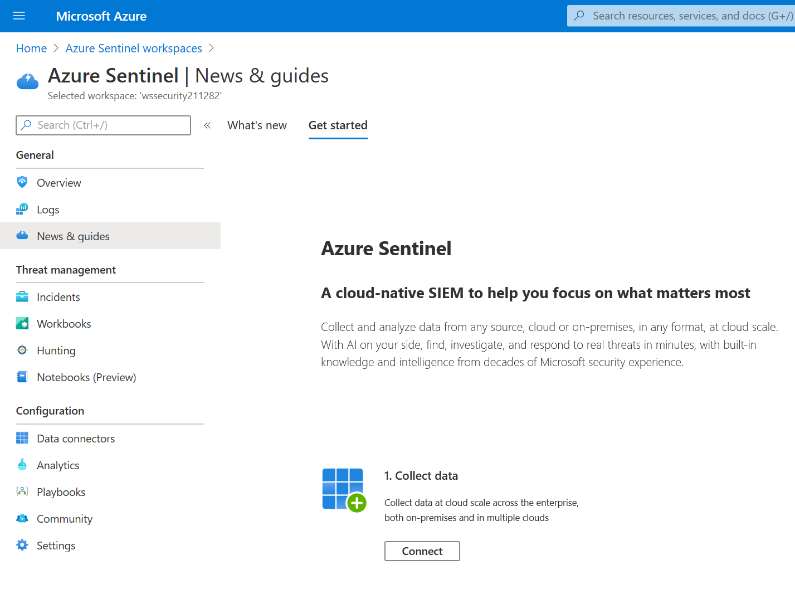

## Exercise 2 : Azure Sentinel Data Sources

### Task 1: Enable Azure Active Directory Connector

1. In the Azure Sentinel blade, under **Configuration**, select **Data connectors**
2. Select **Azure Active Directory**

    

3. In the side dialog, notice the Data Types that will be imported (`SigninLogs`, `AuditLogs`, etc)
4. Select **Open connector page**

    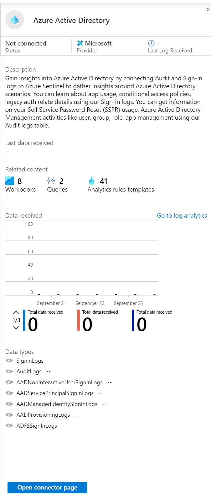

    > **NOTE** You would need to have `global administrator` or `security administrator` access to the Azure AD tenant in order to make the connection. Unfortunately in these labs, your lab user does not have this level of access.

5. Select all items

    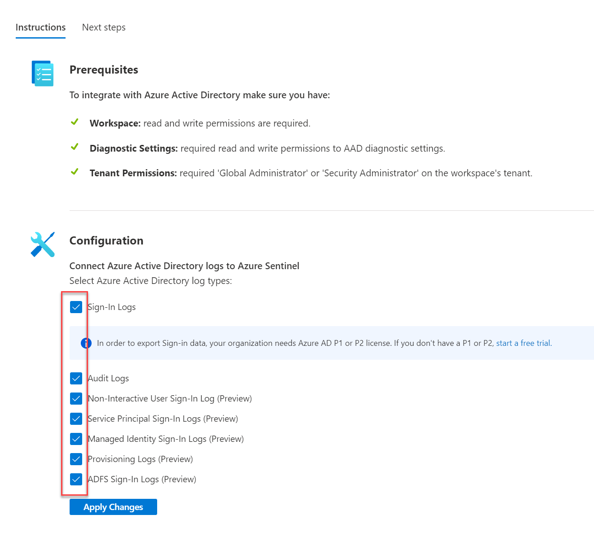

6. Select **Apply Changes**

### Task 2: Enable Azure Active Directory Identity Protection Connector

1. Navigate back to Azure Sentinel blade, select **Azure Active Directory Identity Protection**
2. Select **Open connector page**
3. Select **Connect**
4. Select **Enable**

### Task 3: Enable Azure Defender Connector

1. Navigate back to Azure Sentinel blade, select **Azure Defender**
2. Select **Open connector page**
3. Select your subscription, then select **Connect**
4. In the dialog, select **OK**
5. Select **Enable** to create incidents

    

### Task 3: Enable Microsoft 365 Defender

1. Navigate back to Azure Sentinel blade, select **Microsoft 365 Defender**
2. Select **Open connector page**
3. Select **Connect incidents & alerts**
4. Ensure the **Turn off all Microsoft incident creation rules...** checkbox is selected
5. Check all the checkboxes, then select **Apply Changes**

### Task 4: Enable Cloud App Security

1. Navigate back to Azure Sentinel blade, select **Microsoft Cloud App Security**
2. Select **Open connector page**
3. Select **Cloud Discovery Logs** checkbox
4. Select **Apply Changes**

### Task 5: Enable Defender for Endpoint

1. Navigate back to Azure Sentinel blade, select **Microsoft Defender for Endpoint**
2. Select **Open connector page**
3. Notice that the connector is already connected due to the parent connector **Microsoft 365 Defender** being connected

    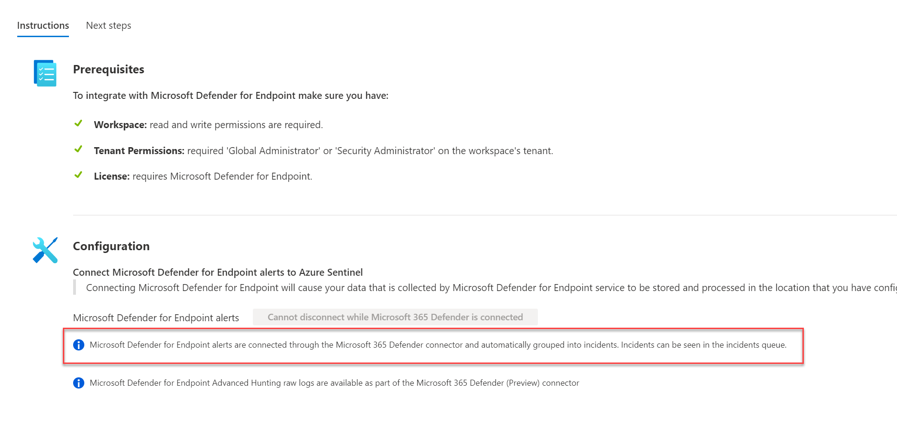

## Exercise 3 : Azure Sentinel Workbooks

1. In the Azure Sentinel blade, under **Threat Management**, select **Workbooks**
2. Select **Azure Defender for IoT Alerts**

   

3. Select **Save**
4. Leave the default selected workbook location, select **OK**
5. Select **View saved workbook**

    

    > **NOTE** You would need to have setup the IoT labs in order to see events\data in this workbook.

6. Browse back to the Sentinel Workbooks blade
7. Select **Microsoft Web Application (WAF)- firewall events**
8. Select **Save**

    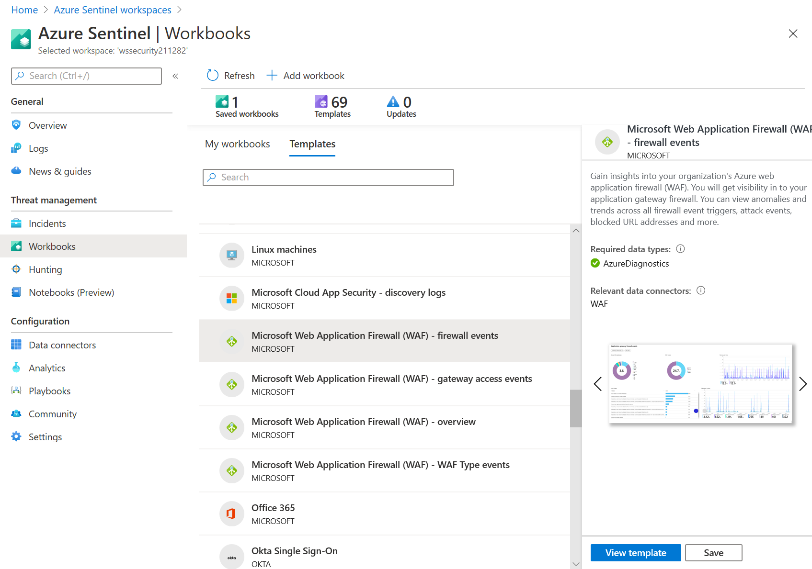

9. Leave the selected workbook location, select **OK**
10. Select **View saved workbook**

    > **NOTE** You would need to have setup the Web Application Firewall in order to see events\data in this workbook.

11. Browse back to the Sentinel Workbooks blade
12. Select **MITRE ATT&CK Workbook**
13. Select **Save**
14. Leave the selected workbook location, select **OK**
15. Select **View saved workbook**
16. Click through the various tabs and review the pre-built reports based on MITRE.

## Exercise 4 : Azure Sentinel Hunting

1. In the Azure Sentinel blade, select **Hunting**
2. Review the page, notice it has several pre-built queries for `hunting` log data for events that are of interest

    

3. Select one of the items, it will display the details of what that item does:

    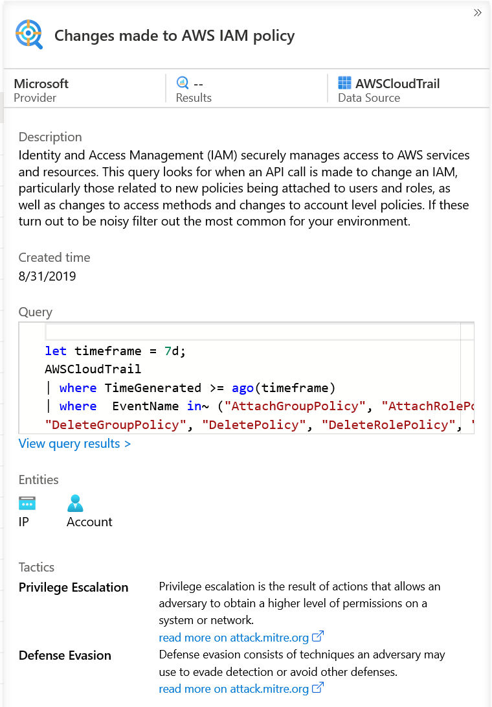

4. Select **Run all queries (Preview)**, you should see all queries start to execute.

    > **Note** You can run these queries, then run them again at a future time to see what the delta is. Typically you would sort based on the number and then explore further if you see results.

## Exercise 5 : Azure Sentinel Entity Behavior

1. In the Azure Sentinel blade, select **Entity Behavior**
2. Select **Configure UEBA**
3. Again, select **Configure UEBA**
4. Set the toggle to **On**
5. Select the **Azure Activity** table
6. Select **Apply**
7. Ensure the **Anomalies** toggle is set to **On**

    > **NOTE** This feature allows you to track based on special types of entities such as Users, Resources, IP Address, etc. It must be enabled by a global admin, any unfortunately our lab environment does not allow for this.

8. Expand the **Playbook permissions**
9. Select **Configure permissions**
10. Select all the resource groups
11. Select **Apply**

## Exercise 6 : Threat Intelligence

1. In the Azure Sentinel blade, under **Threat Management**, select **Threat intelligence**
2. In the top navigation, select **+Add new**
3. For the type, select **ipv4-addr**
4. For the address type **80.89.137.214**

    > **NOTE** This is a known bad ip address originating from Russia and injected into the Azure Security Center and Sentinel logs from previous steps.

5. For the threat types, select all options
6. For the confidence, move the scroll bar to **100**
7. For the valid from, select today's date

    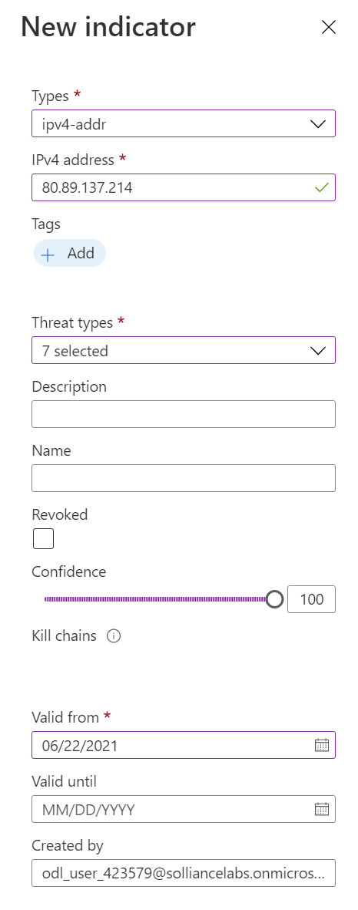

8. Select **Apply**

## Exercise 7 : Azure Sentinel Notebooks

### Task 1: Import Notebook

1. In the **Azure Sentinel** blade, under **Threat Management**, select **Notebooks**.
2. Review the list of sample notebooks, select the **A Getting Started Guide for Azure Sentinel ML Notebooks**, in the dialog, select **Clone notebook template**

    

3. Select the lab machine learning workspace, then select **OK**

    

4. Select **Launch notebook**
5. If not already logged in, enter your lab Azure credentials. If prompted, close any dialogs.
6. Select the machine learning workspace, then select **Get Started**

    

7. In the right navigation, select **Notebooks**
8. In the notebooks section, select the upload button, then **Upload Files**

    

9. Upload the `c:\LabFiles\sentinel-defender-workshop-400\artifacts\day-01\Azure Sentinel ML.ipynb` file to the workspace, when prompted, check both checked boxes, then select **Upload**
10. In the Compute area, select the **+** sign
11. For the name, type **main**
12. Select the **Standard_DS3_v2**

    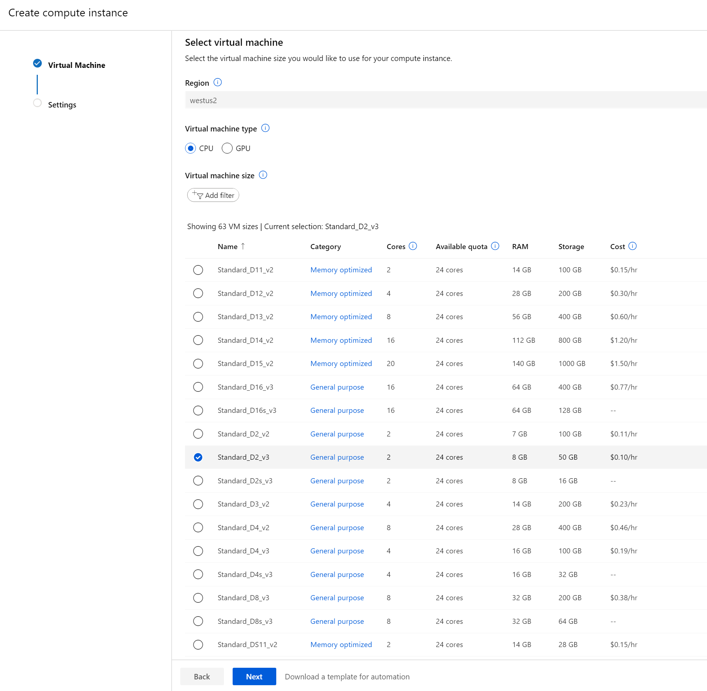

13. Select **Create**. Continue on while the compute is being provisioned.

14. In another browser tab, navigate to the [Azure Active Directory page](https://portal.azure.com/#blade/Microsoft_AAD_IAM/ActiveDirectoryMenuBlade/Overview), copy your `Tenant ID` for use later.

    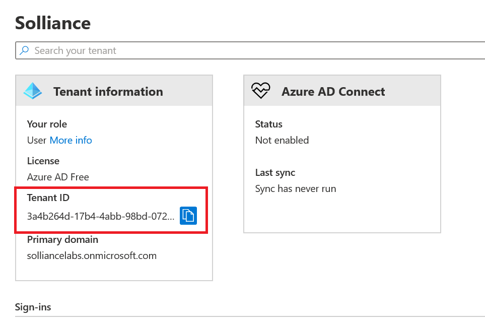

15. Browse to your **wssecuritySUFFIX** log analytics workspace, copy the workspace id.

### Task 2: Create VirusTotal account

1. Open [VirusTotal web site](https://www.virustotal.com/gui/join-us), if you already have an account, [login to it](https://www.virustotal.com/gui)
   - Fill in the form details, select **Join us**
2. Log in to the website, in the top right navigation, select your user icon
3. Select **API Key**

    

4. Copy the API Key for later steps

    

### Task 3: Create MaxMind account

1. Open the MaxMind [sign up page](https://www.maxmind.com/en/geolite2/signup). If you already have an account, [login to it](https://www.maxmind.com/en/account/login)
   - Fill out the sign up form, select **Continue**
2. Login to the MaxMind site
3. Select **Managed License Keys**, then select **Generate new license key**

    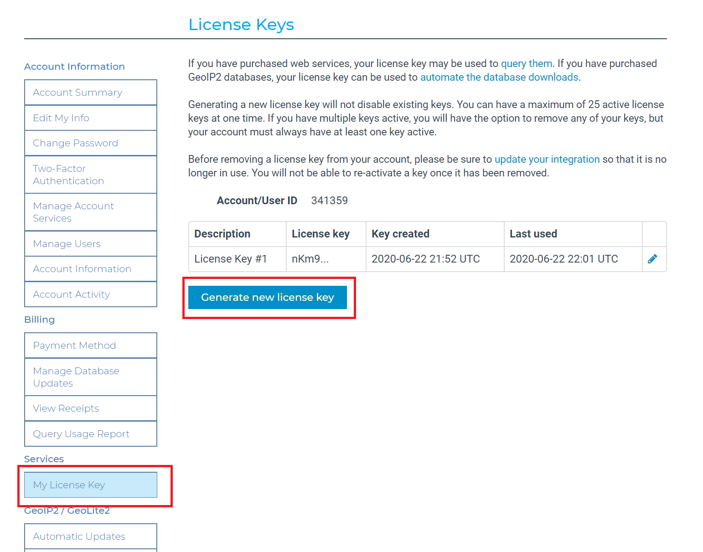

4. Select **No**
5. Select **Confirm**

### Task 4: Execute a Hunt

1. Switch back to the Machine Learning NoteBook, the compute should be provisioned
2. If prompted, select **Start Jupyter kernel**
3. If prompted, select **Authenticate**
4. For each cell select **Run** and follow each of the cells as they are executed. Do not run the entire notebook.

    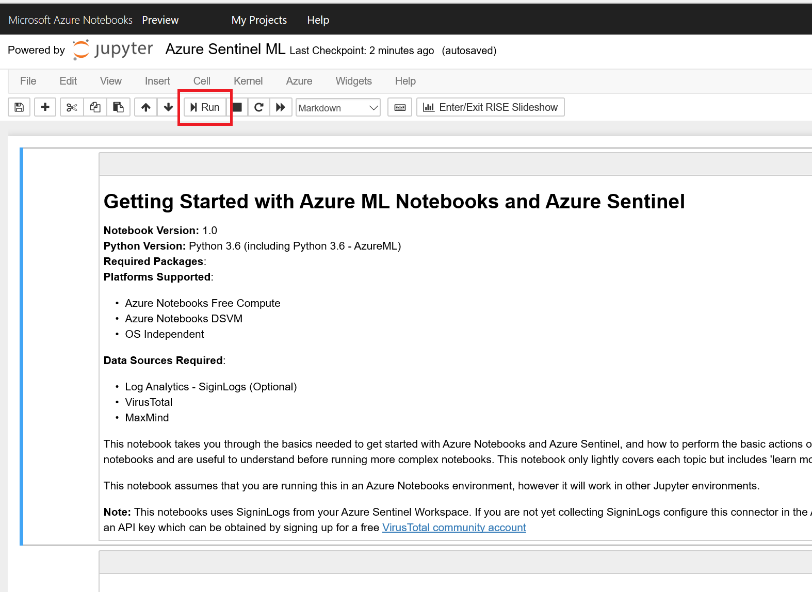

5. Some cells will output information:

    

6. Some will prompt you for data such as the Workspace, TenantId and API keys:

    

7. Another cell will ask you to generate an access token

    

   - Copy the device code and click the **Copy code to dashboard and authenticate**

   - In the dialog that opens, copy the device code

   - Login using the lab username and password

8. Continue to run a few more cells, you should see a cell output the Log Analytics table and the `SigninLogs` schema:

    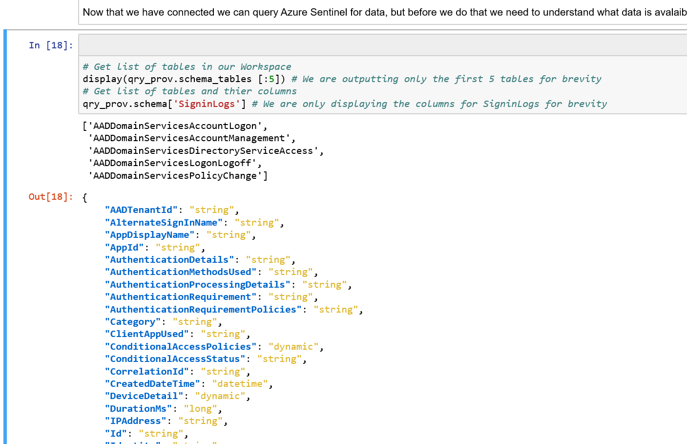

9. One cell will display the queries available to you

    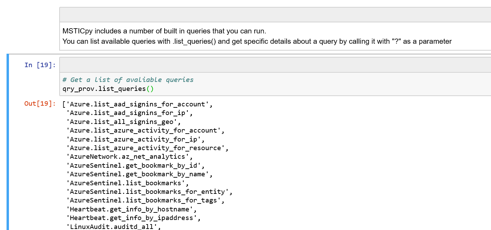

10. The next cell will display kusto query details

    

11. The next cell will execute a query passing in parameters:

    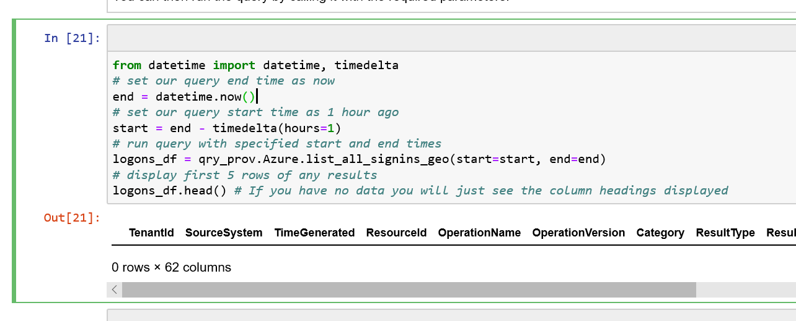

12. Run the remaining cells, you will make calls to the external API providers to enrich the log data with threat levels and IP Address analysis

## Exercise 8 : Export Log Analytics data to Azure Storage

In this exercise you will setup an export rule to send log data to Azure Storage as a backup.

### Task 1 : Create Export Rule

1. Open the `\labfiles\sentinel-defender-workshop-400\artifacts\day-02\ExportLogsToStorage.ps1` PowerShell script in a PowerShell ISE.
2. Review the script, notice the environment values have already been set for you.
3. Press **F5** to run the script, when prompted, enter your lab credentials.
4. You should get a json response back.

    

### Task 2 : Review data

1. Switch to the Azure Portal.
2. Browse to the lab resource group.
3. Select the **wssecuritySUFFIX** storage account.
4. Under **Data storage**, select **Containers**.
5. After some log data is received, you can review the log data sent to the storage account.

    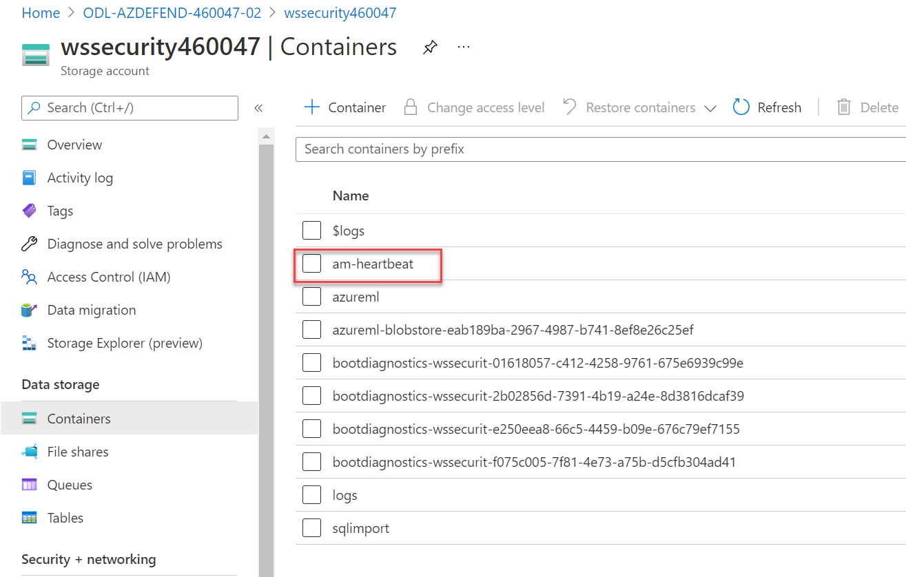

### Task 3 : Query data with Notebooks

1. Open Visual Studio Code
2. Open the `\labfiles\sentinel-defender-workshop-400\artifacts\day-02\ExportLogsToStorage.ipynb` notebook
3. When prompted, select **Install** for recommended extensions, you should see the **Jupyter** extension get installed.
4. Select **Trust** when prompted
5. Select **Yes** when prompted for Python extensions
6. Switch back to the notebook, replace all the values
7. Run the notebook, you should see the data get loaded from the storage account and then displayed to the output.

IMAGE TODO

## Exercise 9 : Exporting Alerts via Logic Apps

You can forward alerts from Sentinel to other SIEMs using the Sentinel APIs and Logic Apps.

### Task 1 : Review the export logic app

1. Open the Azure Portal
2. Browse to your lab resource group
3. Select the `get-sentinelalertsevidence` logic app
4. Select **Edit**
5. Review the steps of the logic app, notice that it exports data from Sentinel and then forwards it to an Event Hub.

> **NOTE** Most SIEMS can consume data from Event Hubs which would allow you to integrate your log analytics data with them. Reference the following:

- [ArcSight](https://community.microfocus.com/t5/ArcSight-Connectors/SmartConnector-for-Microsoft-Azure-Monitor-Event-Hub/ta-p/1671292)
- [LogRhythm](https://docs.logrhythm.com/docs/OCbeats/azure-event-hubs-beat-6-0-2)
- [McAfee](https://docs.mcafee.com/bundle/enterprise-security-manager-data-sources-configuration-reference-guide/page/GUID-B5374BE7-10DF-4869-B189-456E62072398.html)
- [QRadar](https://www.ibm.com/support/knowledgecenter/SS42VS_DSM/com.ibm.dsm.doc/t_dsm_guide_microsoft_azure_enable_event_hubs.html)
- [Splunk](https://docs.splunk.com/Documentation/AddOns/released/MSCloudServices/Configureeventhubs)

## Exercise 10 : Extending Azure Sentinel Incidents (Optional)

This task requires registration to gain access to an API Key. It can take a few days to do this action.

### Task 1 : RiskIQ Api Key

1. Open a browser window to https://api.riskiq.net
2. In the left navigation, select the **Register Now** link, or login to your account
3. Fill out the form, login using the email you used in the form
4. Register and validate your email address in the verification email
5. [Login to the site](https://community.riskiq.com/login), select the profile icon, then select **Account Settings**

    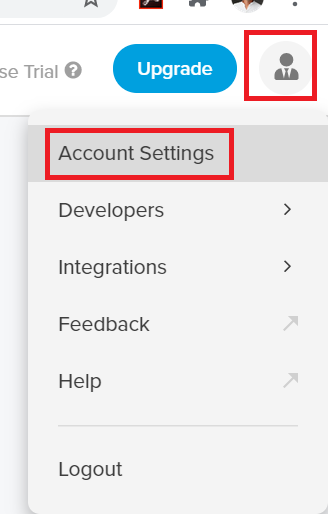

6. Select **Show** for the User, record your API Key and Secret

### Task 2 : Extend Azure Sentinel

1. Switch to the Azure Portal, browse to your resource group
2. Select **Create->Custom deployment**
3. Select **Build your own template in the editor**
4. Copy the **/artifacts/day-02/riskiq-runbook.json** into the template window.
5. Click the **Deploy to Azure** button
6. Be sure you are logged into your lab account
7. Select your subscription and resource group
8. For the playbook name, ensure **Recent-IP-Passive-DNS** is displayed
9. For your username, type the lab username (ex: odl_user_SUFFIX@solliancelabs.onmicrosoft.com)

    

10. Select **Review and create**
11. Select **Create**
12. In the Azure portal, navigate to your Azure Sentinel and your log analytics workspace
13. Select **Automation** from the Azure Sentinel navigation menu, then select **Playbooks**
14. Select the **Recent-IP-Passive-DNS** playbook by selecting the playbook name

    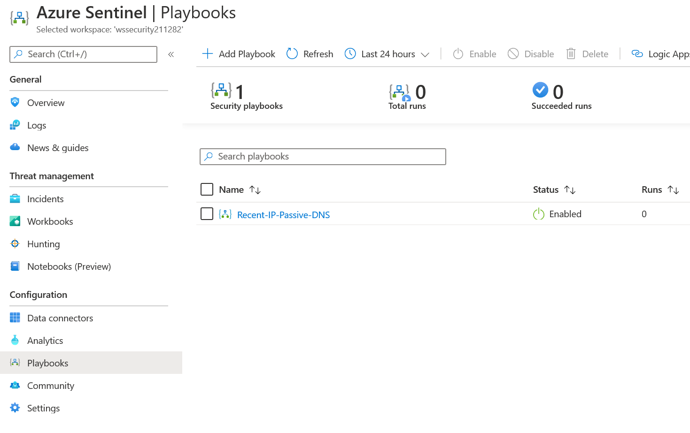

15. Select **Edit** from the top menu of the playbook

    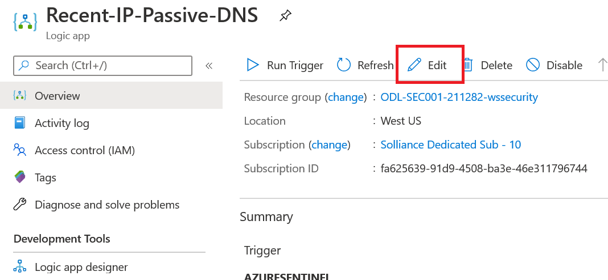

16. There are four steps in this playbook requiring you to configure connections. Select a Connection from one of the steps requiring configuration and configure a new connection. Select the **Invalid** icon

    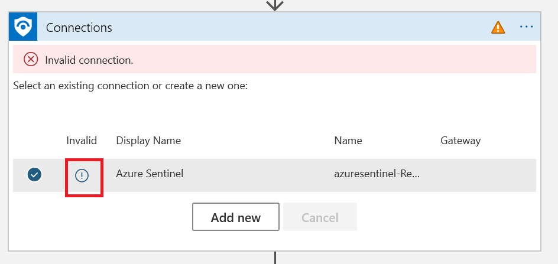

17. Select **Sign in**

    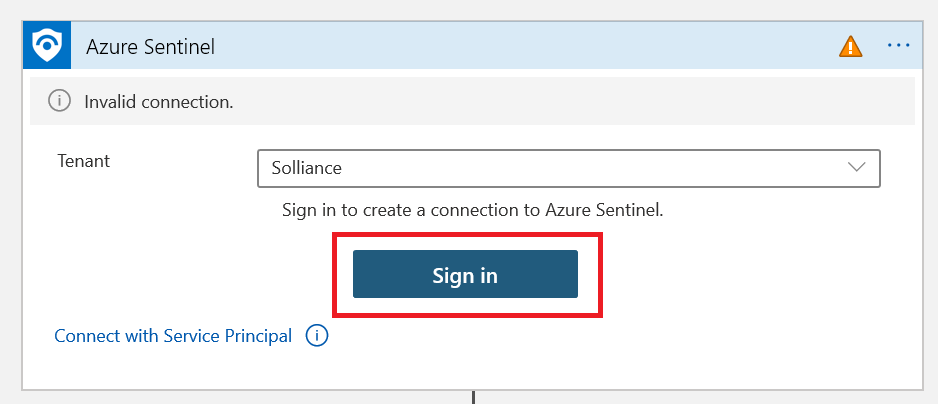

18. Enter your lab username and password.

    > **NOTE** For the connections to Azure Sentinel the user specified when establishing the connection must have sufficient permissions in the Azure Sentinel workspace to read the security alerts.

19. Expand the **For each** activity, select the the RiskIQ connection
20. Select the Invalid icon
21. For the name, type **RiskIQ**
22. Enter your RiskIQ API token and secret obtained from RiskIQ portal

    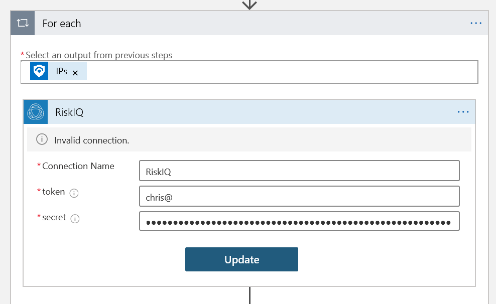

23. Select **Save** from the top menu of the playbook to save the playbook
24. Navigate to your Azure Sentinel **Analytics** page, select the **Custom Threats** rule you created earlier, then select **Edit**

    > **NOTE** The Recent-IP-Passive-DNS playbook works with analytics rules which map IP address entities so make sure you are working with such a rule. For simple testing of the playbook automation you can use rule logic as shown below to force an alert creation with a specific IP address.

    ```output
    AzureActivity
    | take 1
    | extend IPCustomEntity = "144.91.119.160"
    ```

25. Navigate to the **Automated response** tab
26. Place a check mark in the box for the Recent-IP-Passive-DNS playbook which will enable the playbook to run each time the analytic rule generates security alerts
27. Select **Next: Review**
28. Select **Save** to finish and return to the Analytics page

### Task 3 : Review Incident

1. Navigate back to your Azure Sentinel Incidents page
2. Locate the new incident generated from the analytic rule previously and select it
3. Select **View full details** from the information pane
4. Select the **View playbooks** on the far right
5. For the **Recent-IP-Passive-DNS** playbook, select **Run**.  After a few moments you will see a new comment added.
6. Select the **Comments** tab to see the enrichment added by the Recent-IP-Passive-DNS playbook automation. You can also view the information in the RiskIQ portal by following the link provided at the bottom of the comment.

    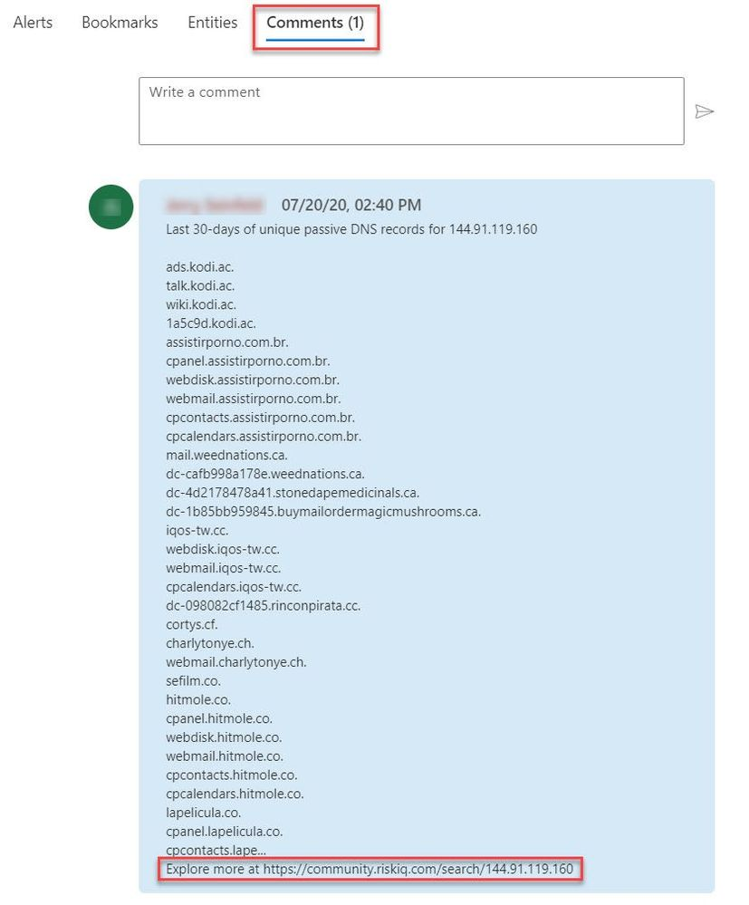

> **Congrats, you have used Machine Learning to analyze signals from your Azure resources and tied that data to Azure Sentinel with extended external API calls for incident enrichment. Good luck on your security journey in Azure!**

## Reference Links

- [What is Azure Sentinel](https://docs.microsoft.com/en-us/azure/sentinel/overview)
- [Investigate incidents with Azure Sentinel](https://docs.microsoft.com/en-us/azure/sentinel/tutorial-investigate-cases)
- Azure Sentinel Notebooks
- [Enrich Azure Sentinel security incidents with the RiskIQ Intelligence Connector](https://techcommunity.microsoft.com/t5/azure-sentinel/enrich-azure-sentinel-security-incidents-with-the-riskiq/ba-p/1534412)

# Resources

- https://docs.microsoft.com/en-us/microsoft-365/security/defender-endpoint/investigate-alerts?view=o365-worldwide
