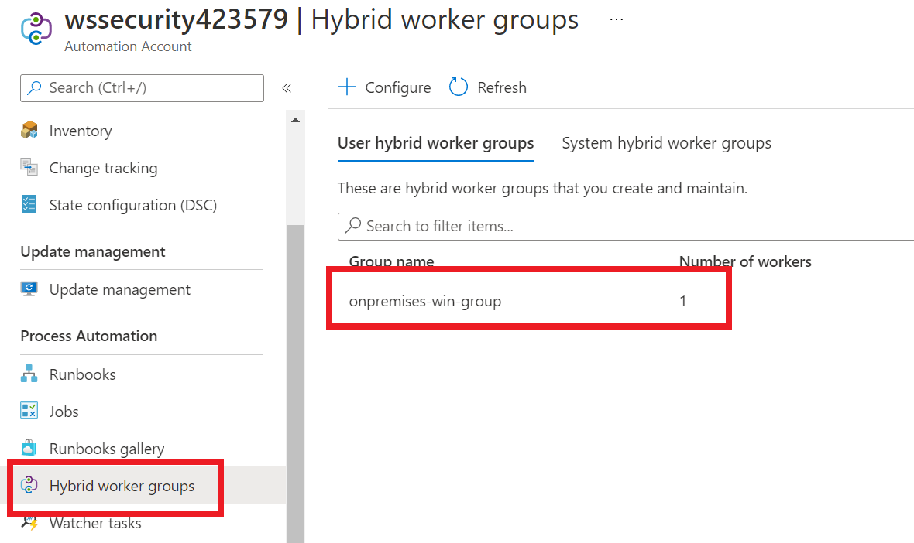
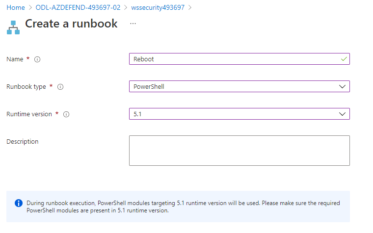
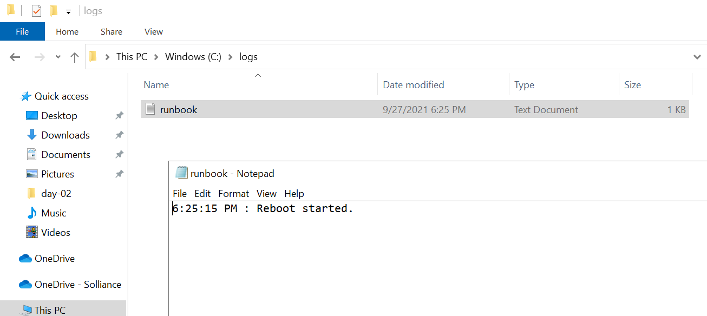
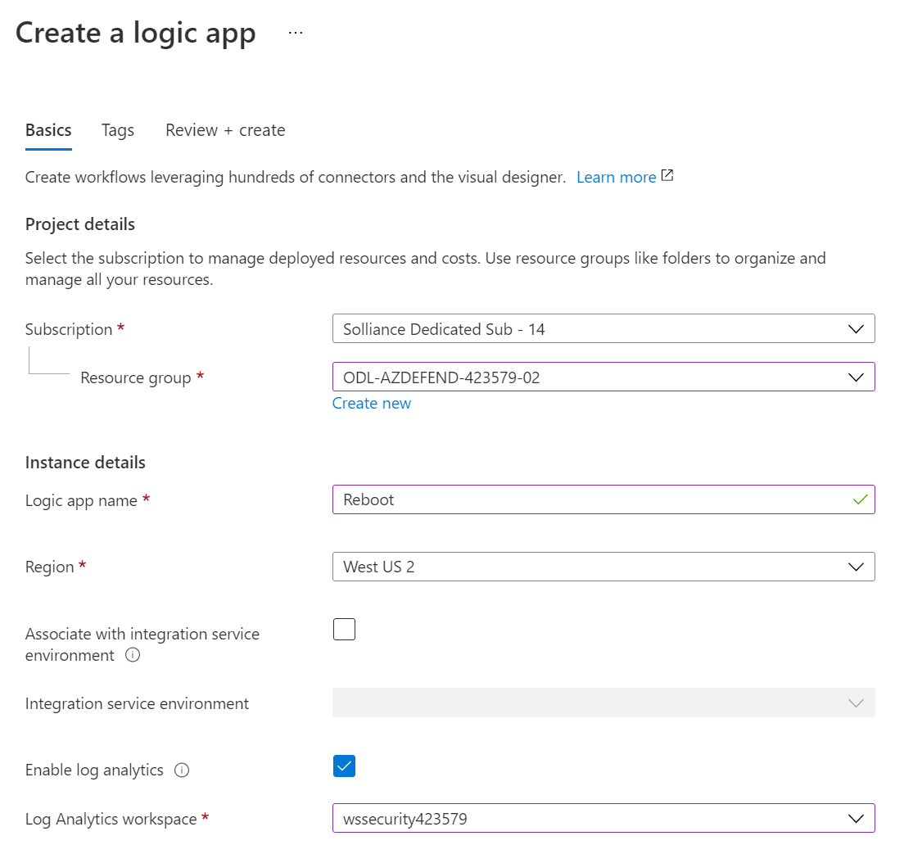
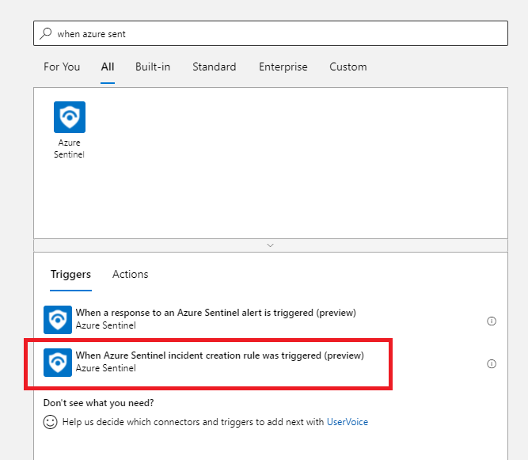
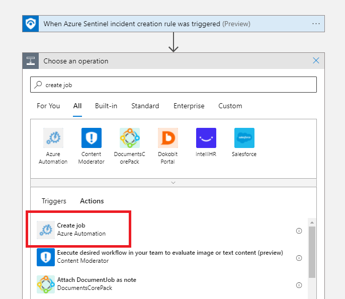
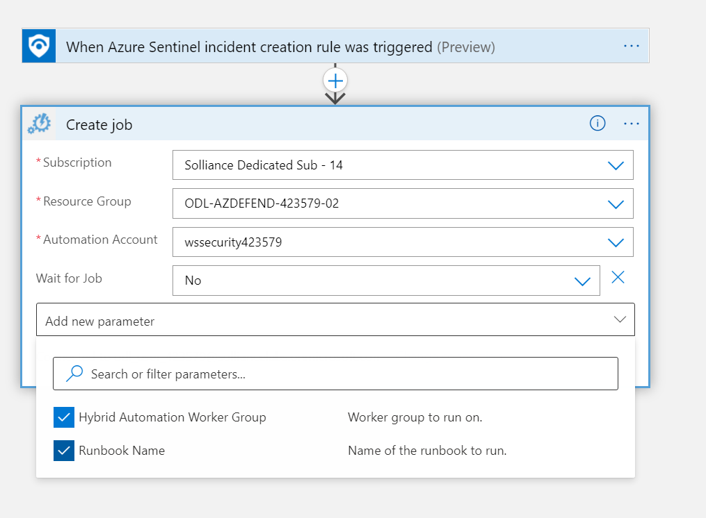
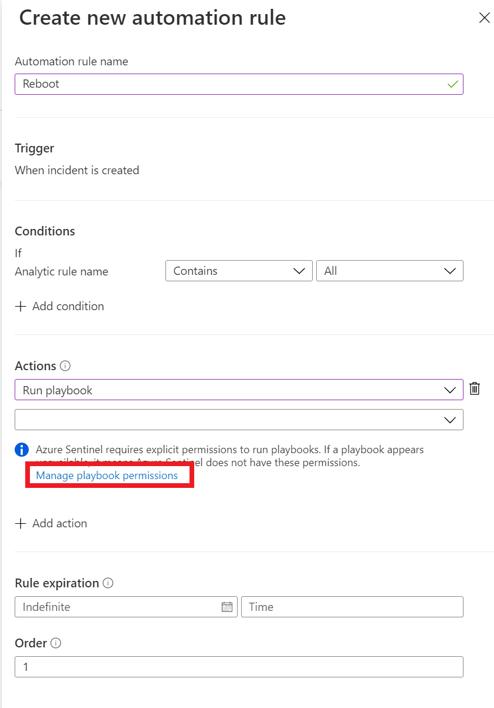

# Lab 5 : Microsoft Defender for Cloud Setup : Setup incident response with on-premises runbooks

## Exercise 1: Setup gateway agent

### Task 1: Enable Azure Automation in Log Analytics Workspace

1. Switch to the **wssecuritySUFFIX-paw-1** virtual machine
2. Open the `c:\labfiles\workshopname\artifacts\day-02\EnableAzureAutomation.ps1` file in a Windows PowerShell ISE window
3. Press **F5** to execute it.

    

### Task 2: Create Hybrid Worker Group and Worker

1. Browse to the **wssecuritySUFFIX** Azure Automation account
2. Under **Account Settings**, select **Keys**
3. Notice the `url` and the `primary access key`, you would need these items in order to register a hybrid worker.

    

4. Switch to the **wssecuritySUFFIX-paw-1** virtual machine
5. Open the `c:\labfiles\workshopname\artifacts\day-02\AddHybridWorker.ps1` file in a Windows PowerShell ISE window.  Notice we have replaced the automation account values for you.
6. Press **F5** to register the machine
7. Switch back to the Azure Automation Account
8. Under **Process Automation**, select **Hybrid worker groups**, you should see your new `onpremises-win-group` displayed

    

### Task 5: Execute a Task

1. Under **Process Automation**, select **Runbooks**
2. Select **Create a runbook**
3. For the name, type **Reboot**
4. For the type, select **PowerShell**
5. For the runtime version, select **5.1**

    

6. Select **Create**
7. In the runbook window, paste the following

    ```PowerShell
    mkdir "c:\logs" -ea silentlycontinue;

    $line = "$([Datetime]::Now.ToLongTimeString()) : Reboot started.";

    Add-Content "c:\logs\runbook.log" $line;
    ```

8. Select **Test pane**

    

9. Select **Hybrid worker**, then select **onpremises-win-group**
10. Select **Start**, wait for the test to complete.

    

11. Switch to your virtual machine, browse to the `c:\logs` folder, notice the new `runbook.log` file

    

12. Switch back to the Automation account, close the test pane
13. Select **Publish**, then select **Yes**
14. Under **Runbook settings**, select **Logging and tracing**
15. Toggle the options to **On**
16. Select **Save**
17. Switch to your VM, in a PowerShell window, run the following, be sure to replace the values:

    ```PowerShell
    Start-AzAutomationRunbook -ResourceGroupName "{RESOURCE_GROUP_NAME}" -AutomationAccountName "{ACCOUNT_NAME}" -Name "Reboot" -RunOn "onpremises-win-group"
    ```

18. Switch to your **paw-1** virtual machine, browse to the `c:\logs` folder, again open the `runbook.log` file, you should see a newline displayed.

### Task 4: Create a Logic App

1. Browse back the Azure Portal
2. In the global search, search for **Logic Apps**, select it.
3. Select **Add**
4. Select the lab subscription and resource group
5. Select **Consumption**
6. For the name, type **Reboot**
7. Select the **Enable log analytics** checkbox
8. Select the **wssecuritySUFFIX** log analytics workspace

    

9. Select **Review + create**
10. Select **Create**, once it is created, select **Go to resource**
11. Under **Templates**, select **Blank Logic App**
12. For the trigger, select **When Azure Sentinel incident creation rule was triggered**

    

13. Select **Sign in**, sign in using your lab credentials
14. Select the **+ New Step** button in the workspace, then select **Add an action**
15. Search for **Create job** in the **Azure Automation** namespace

    

16. Select it, then select **Sign in**
17. Select the lab subscription and resource group
18. Select the **wssecuritySUFFIX** automation account
19. Add the Hybrid Automation Worker Group parameter, set to `onpremises-win-group`
20. Add the Runbook Name parameter, select **Reboot**

    

21. Select **Save**

### Task 5: Configure an Alert / Incident

1. Open the Azure Portal in your **wssecuritySUFFIX-paw-1** virtual machine
2. Select **Azure Sentinel**

    

3. Select the **wssecuritySUFFIX** log analytics workspace
4. Under **Configuration**, select **Automation**
5. Select **Create->Automation rule**
6. For the name, type **Reboot**
7. For the actions, select **Run playbook**
8. Select the **Manage playbook permissions** link

    

9. Select the lab resource group
10. Select **Apply**
11. Select the **Reboot** playbook
12. Select **Apply**

    

### Task 6: Configure an Alert / Incident

1. Open the `/artifacts/day-02/CreateIncident.ps1` in Windows PowerShell ISE
2. Update the values in the script, press **F5** to run it
3. Browse back to Azure Portal and Azure Sentinel
4. Select **Incidents**, you should see a new incident

    

### Task 6: Review Logs

1. Open the `C:\ProgramData\Microsoft\System Center\Orchestrator\{VERSION}\SMA\Sandboxes` directory

    > **NOTE** This directory will not exist until the first job has been executed.

2. Review the log files
3. Open the `c:\logs\runbook.log` file and see a new entry has been added.
